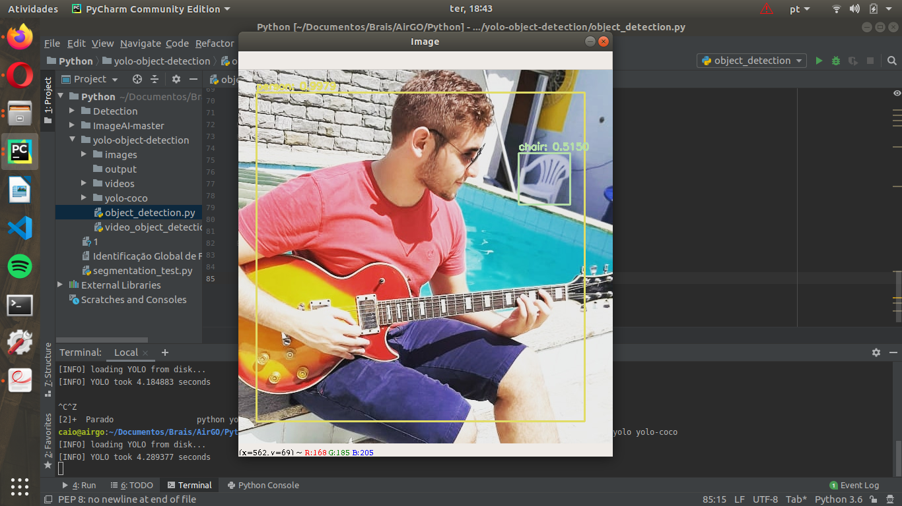
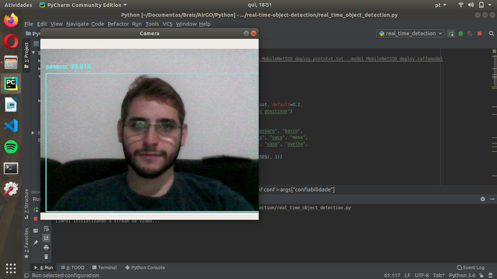
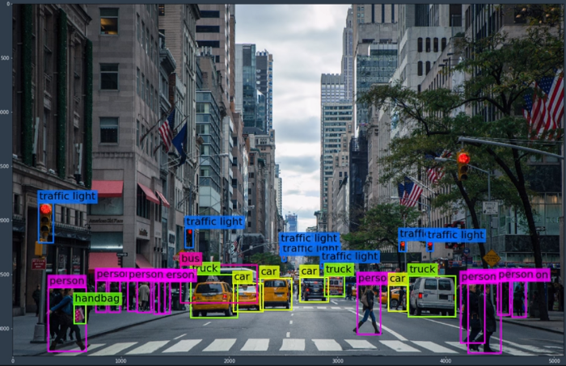
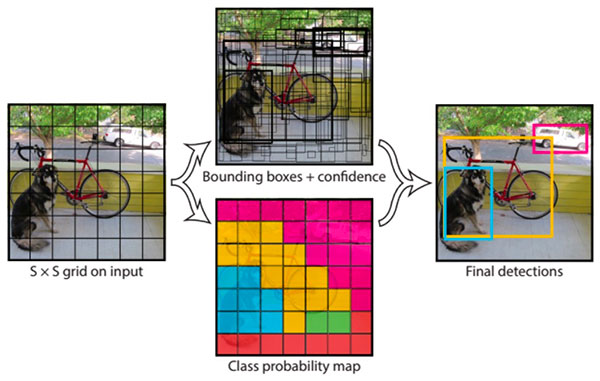

# Processamento de imagens utilizando ROS

## Visão Geral 

Esse pacote foi desenvolvido para solucionar problemas direcionados à visão computacional do projeto. O mesmo conta com diversas contribuições dos desonvolimento das tecnologias específicar da visão computacional, tais como You Only Look Once (YOLO), para que com isso seja possível a detecção de obstáculos, em tempo real, inesperados para a trajetória de entregas dos drones. Além disso, para que todo o processo de mobilidade seja autônomo, é necessário adaptações com o Robot Operating System (ROS), um sistema próprio para a robótica e inteligência artificial.

## YOLO v3

Desenvolvido para que as máquinas possam detectar objetos em fotos, vídeos ou imagens em tempo real, o YOLO conta com uma gama de detecções por meio de quadros do alcance da câmera utilizada, com isso é realizada uma série de análises de comparação em que de acordo com a rede neural utilizada, a imagem capturada é classificada por probabilidade. Veja abaixo um exemplo de captura em tempo real de imagens capturadas por meio de uma câmera RGB obtendo em volta de 45 FPS em uma GPU:






### COCO

Para uma maior acertividade na probabilidade dentre as imagens de objetos distintos, o conjunto de dados [COCO](http://cocodataset.org/#home) já pode auxiliar com mais de 80 objetos distintos, entre eles os mais comuns em áreas urbanas, nas quais os drones irão trabalhar. Dentre eles, estão:
- pessoas;
- bicicletas, carros, motocicletas, aviões, ônibus, trem, caminhonetes, barcos;
- semáforos, hidrantes, placas de trânsito, estacionamento, bancos;
- gatos, cachorros, cavalos, ovelhas, vacas, elefantes, ursos, zebras, girafas;
- mochilas, guarda-chuvas, bolsas, malas, frisbee, bolas, pipas;
- e muitos outros objetos.

### Instalação e arquivos auxiliares

Para a instalação dos arquivos de demonstração do YOLO é necessária a instalação de algumas dependências para o uso da visão computacional:

    $ sudo apt-get update
    $ pip install opencv-python
    $ pip install numpy
    $ pip install imutils
    $ sudo apt-get install ros-melodic-cv-bridge
    $ sudo apt-get install ros-melodic-vision-opencv
    $ sudo apt-get install python-rospy

Para a instalação dos dados fornecidos pelo COCO clone em um diretório em que esteja trabalhando:

    $ git clone https://github.com/cocodataset/cocoapi.git

### Importação de bibliotecas

Ao possuir a plena intalação na máquina, as bibliotecas podem ser importadas:

```python
    import rospy
    import cv2
    import numpy as np
    from imutils.video import VideoStream
    from imutils.video import FPS
    import argparse
    import time
    from std_msgs.msg import String
    from cv_bridge import CvBridge
```

## ROS

O Robot Operating System foi desenvolvido com uma série de frameworks voltados para a robótica, seja para visão computacional, para mobilidade e diversas outras funcionalidades. 
Obs.: É aconselhavel o uso da versão [Melodic](http://wiki.ros.org/melodic/Installation/Ubuntu) (para Ubuntu 18.04) ou [Kinetic](http://wiki.ros.org/kinetic/Installation/Ubuntu) (para Ubuntu 16.04).

### Catkin Worskspace

Para a instalação e organização dos arquivos ROS, é necessário um workspace, no qual escolhemos o [catkin](http://wiki.ros.org/pt_BR/ROS/Tutorials/InstallingandConfiguringROSEnvironment#Instale_o_ROS) por motivos de melhor flexibilidade e organização.

Além disso, é importante a disponibilização do uso da biblioteca de visão computacional [OpenCV](http://opencv.org/) no servidor ROS, portanto é necessário que modifique o arquivo CMakeList.txt do pacote e alterar as definições do pacote:

    find_package(catkin REQUIRED COMPONENTS cv_bridge)

Também deve ser adicionado a permissão no arquivo package.xml:

    <build_depend>cv_bridge</build_depend>
    <exec_depend>cv_bridge</exec_depend>

Para que seja permitida o uso de todos os arquivos python é essencial que seja executado no terminal, no diretório da pasta src do seu pacote em seu workspace, o seguinte comando:

    chmod +x [nome do arquivo]

## A fazer

- Realizar uma conexão entre a biblioteca do python OpenCV, que ainda apresenta problemas;
- Solucionar erros de execução ao compilar o arquivo object_detection.py;
- Coletar informações de publicação nos tópicos criados ao conectar com o servidor do ROS.